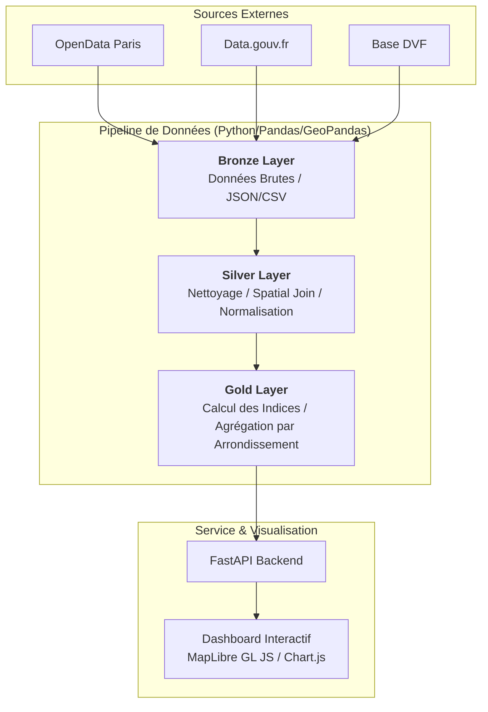

# 🏙️ Urban Data Explorer

> **Le futur du logement parisien, décrypté par la donnée.**

[](https://www.python.org/)
[](https://fastapi.tiangolo.com/)
[](https://pandas.pydata.org/)
[](https://maplibre.org/)
[](#-architecture-technique)
[]()
[](./docs/)
[](./LICENSE)

---

**Urban Data Explorer** est une plateforme d'intelligence spatiale conçue pour analyser les dynamiques socio-économiques et immobilières de Paris. Ce projet suit une architecture **Medallion (Bronze/Silver/Gold)** pour transformer des données brutes hétérogènes en indicateurs décisionnels haut de gamme.

## 👥 Équipe Projet & Rôles

Ce projet a été réalisé dans le cadre du **Mastère Data Engineering et IA (DE2)** par :

| Membre | Rôle Principal | Responsabilités Techniques |
| :--- | :--- | :--- |
| **[Adam BELOUCIF](https://github.com/Adam-Blf)** | **Architecte Lead & Backend** | Design système, API REST FastAPI, Déploiement |
| **[Emilien MORICE](https://github.com/emilien754)** | **Dataviz & Silver Pipeline** | Frontend MapLibre, Transformation spatiale |
| **[Arnaud DISSONGO (Panason1c)](https://github.com/Panason1c)** | **Data Engineer & Analytics** | Ingestion (Bronze), Agrégation (Gold) |

---

## 🏗️ Architecture Technique (Architecture Médaille)

Nous avons implémenté un pipeline de données industriel divisé en trois couches logiques :



---

## 📊 Stratégie de Données (15+ Datasets)

Le projet fusionne des sources gouvernementales et municipales pour créer 4 indicateurs composites :

1.  **🌿 Indice de Qualité de Vie** : Densité d'espaces verts et proximité des services publics (écoles, collèges, hospitalier).
2.  **🚗 Indice de Mobilité Urbaine** : Connectivité Vélib', bornes de recharge électrique, pistes cyclables et fluidité du stationnement.
3.  **🏛️ Indice de Patrimoine Culturel** : Concentration en monuments historiques, musées nationaux et richesse de l'agenda culturel.
4.  **🏘️ Indice de Tension Immobilière** : Ratio de logements sociaux par rapport au prix moyen au m² et impact des chantiers urbains.

---

## 🧩 Structure du Projet

```bash
urban-data-explorer/
├── api/                  # Backend : FastAPI (Adam BELOUCIF)
├── data/                 # Entrepôt local (Bronze/Silver/Gold)
├── docs/                 # Documentation technique approfondie
├── frontend/             # Dashboard interactif (Emilien MORICE)
└── pipeline/             # ETL & Logic de calcul (Arnaud & Emilien)
    ├── ingest.py         # Ingestion (Phase Bronze)
    ├── transform.py      # Nettoyage Spatial (Phase Silver)
    ├── aggregate.py      # Analytics (Phase Gold)
    └── data_quality.py   # Tests de qualité (Phase Audit)
```

---

## 🚀 Lancement Rapide

### 1. Préparation de la donnée (ETL)
```bash
cd pipeline
pip install -r requirements.txt
python run_pipeline.py
```

### 2. Démarrage de l'API
```bash
cd api
pip install -r requirements.txt
uvicorn main:app --reload
```

### 3. Consultation du Dashboard
Ouvrez le fichier `frontend/index.html` dans un navigateur ou lancez :
```bash
cd frontend
python -m http.server 3000
```

