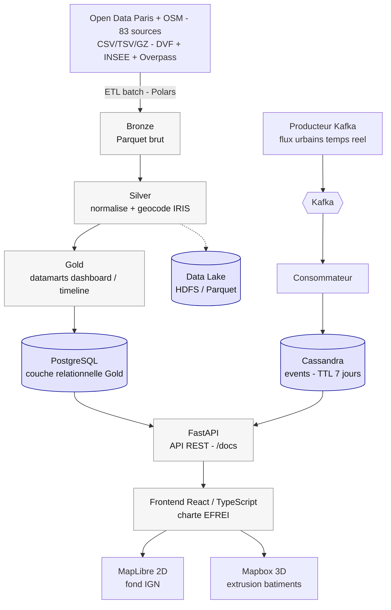
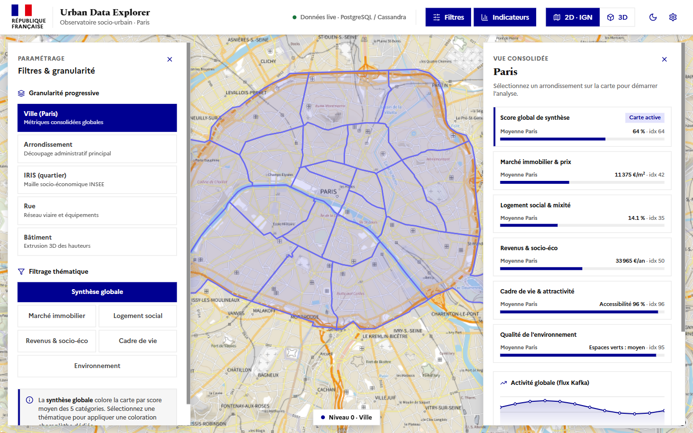

# Urban Data Explorer - Paris

<!-- adam-badges:start -->
[](https://github.com/Adam-Blf/urban-data-explorer/commits)
[](https://hits.sh/github.com/Adam-Blf/urban-data-explorer/)
[](https://github.com/Adam-Blf/urban-data-explorer/commits)
[](https://github.com/Adam-Blf/urban-data-explorer)
[](LICENSE)
<!-- adam-badges:end -->

<!-- Certification & Project Status Badges -->
<div align="center">

[](https://www.francecompetences.fr/recherche/rncp/40875/)
[](#)
[](#)
[](#)

</div>

<!-- Tech Stack Badges -->
<div align="center">

[](#)
[](#)
[](#)
[](#)
[](#)
[](#)

[](#)
[](#)
[](#)
[](#)
[](#)
[](#)
[](#)
[](#)

</div>

---

Un tableau de bord cartographique pour l'exploration, en temps réel et en différé, des indicateurs socio-urbains de Paris. L'interface adopte la **charte graphique EFREI** : police Gilroy, bleu `#163767`, rose `#FF43B8`, fond de plan **IGN Géoplateforme**, thèmes clair/sombre et accessibilité WCAG AA.

Projet réalisé en binôme par **Adam Beloucif & Émilien Morice**, validant les compétences du **Bloc 1 du titre RNCP40875 (Expert en Ingénierie des Données)**, certificateur Efrei - Paris Panthéon-Assas Université.

---

## Architecture

Stack médaillon locale-first ou distribuée, du CSV Open Data à la cartographie 3D.


```mermaid
flowchart TD
   OD["Open Data Paris + OSM - 83 sources<br/>CSV/TSV/GZ - DVF + INSEE + Overpass"]
   OD -->|"ETL batch - Polars"| BRONZE["Bronze<br/>Parquet brut"]
   BRONZE --> SILVER["Silver<br/>normalise + geocode IRIS"]
   SILVER --> GOLD["Gold<br/>datamarts dashboard / timeline"]
   SILVER -.-> LAKE[("Data Lake<br/>HDFS / Parquet")]
   GOLD --> PG[("PostgreSQL<br/>couche relationnelle Gold")]
   PROD["Producteur Kafka<br/>flux urbains temps reel"] --> KAFKA{{"Kafka"}}
   KAFKA --> CONS["Consommateur"] --> CASS[("Cassandra<br/>events - TTL 7 jours")]
   PG --> API["FastAPI<br/>API REST - /docs"]
    CASS --> API
    API --> FE["Frontend React / TypeScript<br/>charte EFREI"]
    FE --> M2["MapLibre 2D<br/>fond IGN"]
    FE --> M3["Mapbox 3D<br/>extrusion batiments"]

    classDef store fill:#e3e3fd,stroke:#000091,color:#161616;
    classDef proc fill:#f6f6f6,stroke:#929292,color:#161616;
    class PG,CASS,LAKE store;
    class BRONZE,SILVER,GOLD,API,FE proc;
```

1. **ETL & Data Lake (C2.3, C2.4)** : Logique Bronze → Silver → Gold implémentée avec **Polars** (moteur ultra-rapide en Rust), avec géocodage offline par point-in-polygon sur les zones IRIS de Paris.
2. **Base de données relationnelle (C1.1)** : PostgreSQL modélisé en couche Gold relationnelle, optimisé avec clés étrangères, index de performance et contraintes d'intégrité.
3. **Base de données NoSQL (C1.2)** : Cassandra stockant les snapshots d'événements de streaming.
4. **Messagerie & Streaming (C2.2)** : Producteur/Consommateur Kafka écrivant les flux urbains en temps réel dans Cassandra.
5. **API (C2.1)** : FastAPI exposant les routes filtrables, documentée automatiquement sous `/docs`.
6. **Interface Utilisateur (Cartographie 3D & 2D)** : Application SPA développée en **React**, **TypeScript** et **Vite**.
   - **MapBox GL JS** pour le rendu 3D des bâtiments et le pitch/tilt dynamique.
   - **MapLibre GL JS** pour la version 2D classique et fluide.
   - Granularité progressive à 5 niveaux : **Ville → Arrondissement → IRIS → Rue → Bâtiment**.
   - Grise automatiquement les zones/panneaux non ciblés par le filtre en cours pour focaliser l'attention sur la carte principale.

---

## Lancement rapide (sans Docker)

```bash
# Backend
pip install -r requirements.txt
uvicorn api.main:app --reload --port 8000

# Frontend (autre terminal)
cd frontend && npm install && npm run dev
```

Ouvrir `http://localhost:5173`. L'API est disponible sur `http://localhost:8000/docs`.

> **Note:** les scripts `.ps1` et `.bat` ne sont pas utilisés (bloques par EDR en environnement hospitalier). Utiliser `python` directement.

---

## 🐳 Lancement avec Docker & Multi-Services (Optionnel)

Le projet dispose d'une infrastructure complète conteneurisée :

1. Démarrez les services core (PostgreSQL + Cassandra avec init schema auto) :
   ```bash
   docker-compose up -d postgres cassandra cassandra-init
   ```
2. *(Optionnel)* Démarrez la stack streaming et big data (Kafka, Zookeeper, Hadoop/HDFS, Hive) :
   ```bash
   docker-compose --profile streaming --profile lake up -d
   ```
3. L'API FastAPI et le Frontend React peuvent également être lancés via Docker :
   ```bash
   docker-compose up -d api frontend
   ```
4. *(Init Cassandra hors Docker)* Pour initialiser le schema Cassandra en local :
   ```bash
   python scripts/init_cassandra.py --host localhost --port 9042
   ```

---

## Sources de données (83 sources, 4 familles)

Le catalogue ([`etl/catalog.py`](etl/catalog.py)) référence **83 sources** dont **30 via OpenStreetMap Overpass**, réparties en 4 familles thématiques :

| Famille | Sources | Exemples |
|---|---|---|
| Mobilite & Accessibilite | 17 | Velib, IDFM, cyclable, IRVE, bus/metro OSM |
| Vie quotidienne | 42 | Education, sante, commerce, culture, lieux OSM |
| Environnement & Cadre de vie | 12 | Espaces verts, arbres, ilots chaleur, bruit |
| Logement & Urbanisme | 12 | DVF, DPE, logements sociaux, MH, Filosofi |

**Sources externes réelles** (chargées par [`etl/external.py`](etl/external.py), remplaçant les valeurs de référence) :
- **DVF - Demandes de Valeurs Foncières** (DGFiP / data.gouv.fr) : transactions immobilières 2023, département 75 → **prix au m² médian réel** et **volume de ventes** par arrondissement.
- **INSEE Filosofi 2020** : revenu médian disponible par quartier IRIS → **revenu médian réel** agrégé par arrondissement.

Téléchargement :
```bash
# DVF (transactions 75, 2023)
curl -L -o data/raw/downloads/dvf_75_2023.csv.gz \
  https://files.data.gouv.fr/geo-dvf/latest/csv/2023/departements/75.csv.gz
# INSEE Filosofi IRIS 2020
curl -L -o data/raw/downloads/filosofi_iris_2020.zip \
  https://www.insee.fr/fr/statistiques/fichier/7233950/BASE_TD_FILO_DISP_IRIS_2020_CSV.zip
```
Chaque enregistrement Gold porte un drapeau `data_source` (`real` / `reference`) pour la traçabilité qualité.

## 🛠️ Indicateurs personnalisés (Gold)

Les données de synthèse sont classées en catégories d'indicateurs comparatifs côte-à-côte :
1. **Marché immobilier & prix** : prix au m² (`prix_m2`) et volumes de ventes (`sales_volume`) - **réels (DVF 2023)**.
2. **Logement social** : part (%) (`logement_social_pct`) et nombre de logements financés (`logements_sociaux_count`).
3. **Revenus & socio-éco** : revenu disponible médian par ménage (`revenu_median`) - **réel (INSEE Filosofi 2020)**.
4. **Accessibilité au logement** : `m2_abordables` = revenu annuel médian / prix au m² (combien de m² une année de revenu permet d'acheter), indice `accessibilite_idx` - **indicateur croisé prix/revenus** demandé par l'énoncé.
5. **Cadre de vie & environnement** : accessibilité transports/santé/culture, densité d'espaces verts.
6. **Synthèse globale (Score)** : moyenne des indices de catégories par arrondissement.

---

## 🎨 Interface (charte EFREI)

L'interface adopte la charte graphique EFREI : police **Gilroy** (display) + Poppins (corps), bleu profond `#163767`, rose signature `#FF43B8`, bleu secondaire `#0C78B4`. Fond de plan **IGN Géoplateforme** en 2D, **Mapbox** en 3D, thèmes clair et sombre, contrastes WCAG AA.



## 📑 Livrables de soutenance

Les supports sont générés de façon reproductible (charte EFREI) :

```bash
python scripts/generate_report_pdf.py     # -> rapport.pdf (rapport de soutenance)
python scripts/generate_slides_pptx.py     # -> soutenance.pptx (support oral, 16 slides)
```

## 🔐 API - authentification & quotas (C2.1)

L'API expose une authentification **JWT** (OAuth2 password flow) et un **limiteur de débit par IP**.

```bash
# Obtenir un jeton (comptes de démo : demo/demo ou admin/admin)
curl -X POST http://127.0.0.1:8000/auth/token -d "username=admin&password=admin"
# Appeler une route protégée (rôle admin requis)
curl http://127.0.0.1:8000/auth/me -H "Authorization: Bearer <TOKEN>"
```

- **Authentification** : jetons signés HS256, rôles `viewer` / `admin`, expiration 60 min.
- **Autorisations** : route `/auth/me` réservée au rôle `admin` (401 sans jeton, 403 si rôle insuffisant).
- **Quotas** : fenêtre glissante par IP - 120 req-min anonyme, 600 req-min authentifié, sinon `429 Too Many Requests`.
- **CORS restreint** à l'origine du frontend (`UDE_CORS_ORIGINS`).
- **API filtrable** : `GET /datamarts/dashboard?arrondissement=75011&score_min=70&sort=score`.

## 🏛️ Alignement avec la Grille d'Évaluation RNCP40875 (Bloc 1)

| Compétence | Description de la compétence évaluée | Preuve de mise en œuvre dans le projet | Statut |
| :--- | :--- | :--- | :---: |
| **C1.1** | Concevoir et structurer une base de données relationnelle | Modèle relationnel en couche Gold mis en place dans [postgres/init.sql](postgres/init.sql). Script de test de charge : [scripts/test_load_postgres.py](scripts/test_load_postgres.py). | **Conforme** |
| **C1.2** | Concevoir et structurer une base de données non-relationnelle (NoSQL) | Modélisation orientée requêtes dans Cassandra pour stocker les snapshots d'événements de streaming ([cassandra/schema.cql](cassandra/schema.cql)). | **Conforme** |
| **C1.3** | Configurer et requêter un cluster de stockage (Data Lake) | Architecture de stockage Bronze → Silver → Gold organisée par répertoires et fichiers Parquet optimisés. | **Conforme** |
| **C1.4** | Architecturer des infrastructures scalables et résilientes | Docker Compose : `restart: unless-stopped`, **healthchecks** (postgres, cassandra, api), démarrage ordonné (`depends_on: service_healthy`), **volumes persistants**, profils `streaming`/`lake`. Mode local-first hors ligne. [ADR](docs/ADR/0001-architecture-data.md). | **Conforme** |
| **C2.1** | Développer une API Rest pour exposer les données | API FastAPI (`api/main.py`) documentée via Swagger (`/docs`). **Authentification JWT** (OAuth2, rôles viewer/admin) et **quotas par IP** (anonyme 120 / authentifié 600 req-min) dans [`api/security.py`](api/security.py). | **Conforme** |
| **C2.2** | Développer un programme de collecte en temps réel (Streaming) | Ingestion continue des données (Vélib, chantiers) à l'aide d'un couple Producteur/Consommateur Kafka. | **Conforme** |
| **C2.3** | Écrire des scripts de transformation et d'agrégation | Polars : nettoyage, normalisation des codes, jointures spatiales IRIS et **fusion de sources réelles** (DVF 2023 + INSEE Filosofi 2020) dans [`etl/external.py`](etl/external.py) + [`etl/processing.py`](etl/processing.py). | **Conforme** |
| **C2.4** | Optimiser les performances de traitement et stockage | Parquet colonnaire (Silver/Gold), index PostgreSQL (p95 < 4 ms), drapeau qualité `data_source` (`real`/`reference`) sur chaque enregistrement Gold. | **Conforme** |


## Star History

<a href="https://www.star-history.com/?repos=Adam-Blf%2Furban-data-explorer&type=date&legend=top-left">
 <picture>
   <source media="(prefers-color-scheme: dark)" srcset="https://api.star-history.com/chart?repos=Adam-Blf/urban-data-explorer&type=date&theme=dark&legend=top-left" />
   <source media="(prefers-color-scheme: light)" srcset="https://api.star-history.com/chart?repos=Adam-Blf/urban-data-explorer&type=date&legend=top-left" />
   
 </picture>
</a>
