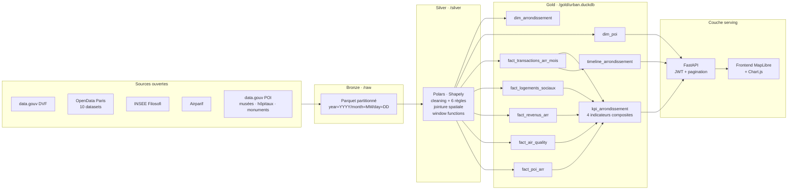
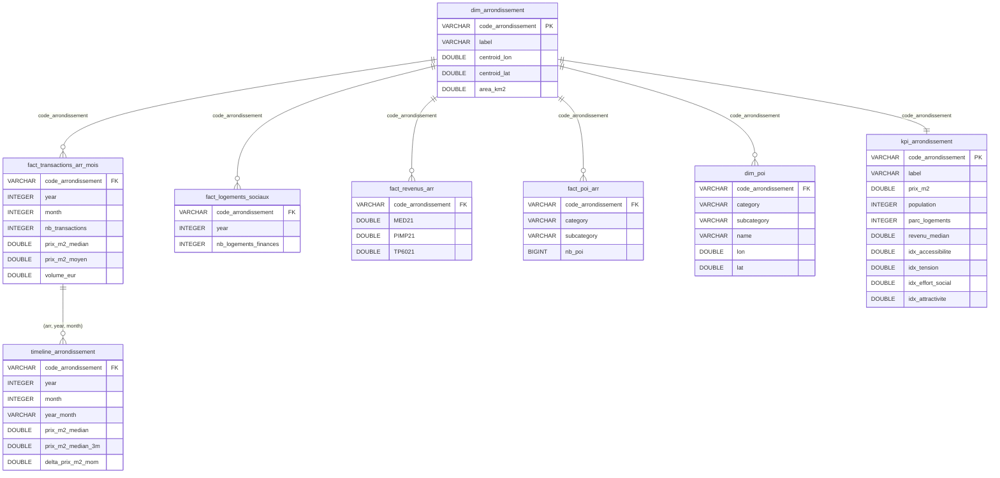
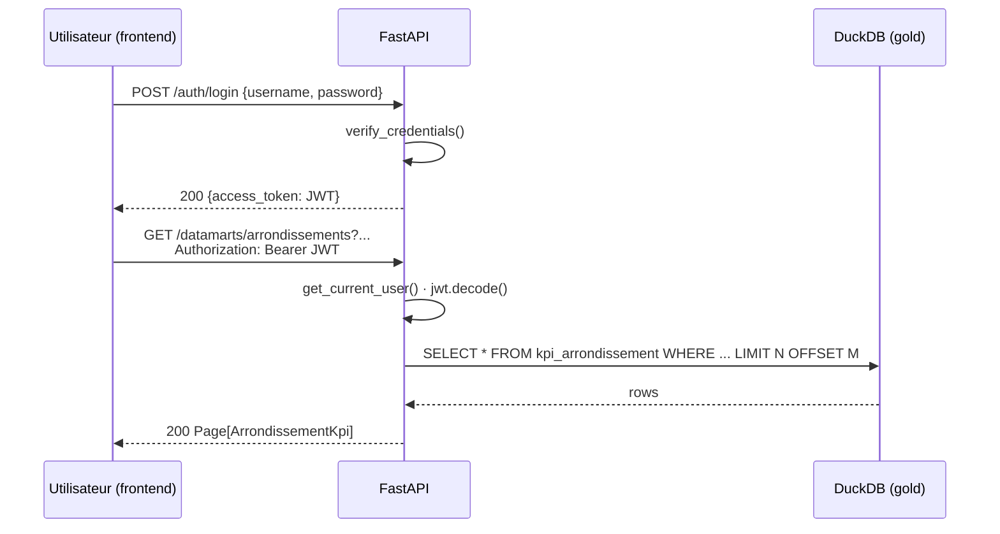
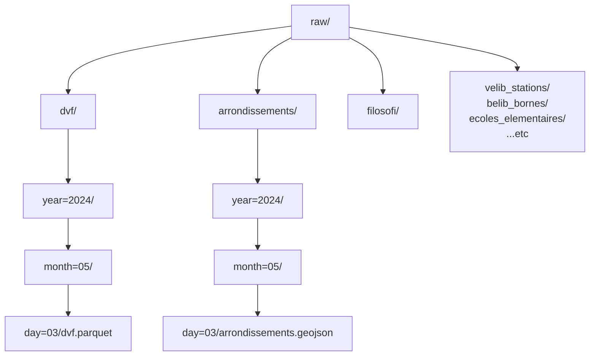

# Schémas data

Diagrammes Mermaid · GitHub les rend nativement dans la preview Markdown.

## 1. Pipeline médaillon · vue d'ensemble

## 2. Modèle relationnel Gold

## 3. Flux d'authentification API

## 4. Partitionnement Bronze/Silver

